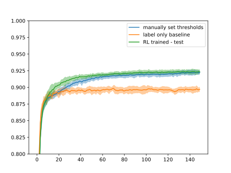
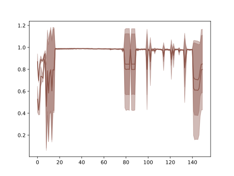

# Notes

In these notes, we present the development and current state of the master's thesis titled Learning Learning Strategies Through Learning. We present some cognitive and computational background, proceed to our method and finish up with results and discussion. 

## Background

**TODO**

## Method

Within our system, we train two models - first one solves the base problem, while the second one solves the meta-problem as described in the following sections. 

### Base-model training

We train our base-model to classify digits from a MNIST dataset. MNIST dataset consists of 10 classes, each representing one digit 0-9, and 60000 train and 10000 test samples. As a starting point, we used a simple fully connected neural network architecture with 4 layers, each consisting of 512, 1024, 512 and 256 neurons, respectively. Adam optimizer that minimizes categorical crossentropy between target and output classes is used to train the model. 

Furthermore, we also train the base model in semi-supervised manner. To achieve that, we hide the majority of samples from the MNIST dataset, and use only 500 and 1500 samples for training and validations sets. To achieve better robustness and label stability, a method similar to [cite the temporal ensambling paper] is used, where labels are averaged over time:

```python
_y = _y * (1 - tau) + f(X) * tau
```
where `_y` is our exponential label average, `f(X)` is the output of our base-model in current iteration and `tau` is the label learning rate. We initialize the `_y` matrix to uniform distribution for each sample. 

### Meta-model training

Training the meta-model is done using reinforcement learning, which is modeled as a Markov decision process where state transition probability distributions are not known in advance.

We use soft actor-critic (SAC) method [citation] to learn a policy. SAC uses one policy (P(s)), two value (V(s)) and state-action value (Q(s, a)) networks. Among Q-value networks the one outputing lower value of a state given the action is chosen on every iteration. One of the two value networks learns the value function directly, while the other one learns indirectly by copying the parameters on every iteration:
```python
V_target = V_target * (1 - tau) + V * tau
```

Soft actor-critic is policy gradient method, which means that the policy is optimized in the following matter:
```

```

The observation which would fully describe the base-models current state and consequently satisfy the Markov property could consist of all model's weight values. Since that is unfeasable, we decided to simplify the observations so they consist of only output probability distributions on validation set for each class. Observations therefore have size of `N_CLASSES ** 2 + 5`, where 5 additional values are*:
- percentage of samples selected: `N_SELECTED / N_UNLABELED`,
- cross entropy loss on validation set,
- accuracy on validation set,
- cross entropy loss on training set,
- accuracy on training set.

Agent is trained in continiuous observation and action spaces. Reinforcement learning agent outputs an action given an observation and its current policy in a form of a 2D vector:
```python
a = [a_mean,
     a_bound],
```
where `a` ∈ [-1, 1]

Action vector is the used to calculcate upper and lower confidence bounds. At this point, we define confidence of a sample `x` as:
```python
c = max(P(x))
```
where `P(x)` is the probability distribution over sample `x` in our averaged prediction matrix `_y`.

Furthermore, to obtain aforementioned upper and lower selection bounds, we first transform action `a` so that bound is appropriately scaled:
```python
_a_mean = (a_mean - 1) / 2
_a_bound = (0.5 - abs(0.5 - _a_mean)) * (a_bound - 1) / 2
```

and then used the scaled `_a_bound` to form upper and lower bounds for sample selection:
```python
bound_lower = _a_mean - _a_bound
bound_upper = _a_mean + _a_bound
```

Using scaling the way we just described ensures that the thresholds are on interval [0, 1]. That way, actions outputted by the agent cover the whole action space, while also uniquely determining sample selection thresholds. 

*effect of these additional values is currently not known.

**TODO: REWARD**

To gather *experience* from which we derive our optimal policy we consecutively train our base model for `n` epochs and determine a new threshold pair at every step. Pseudocode of our algorithm looks like this:

```python
Initialize RL networks: P(s), V(s), V_target(s), Q_1(s, a), Q_2(s, a)
Initialize replay_buffer.
for episode in range(N_EPISODES):
    # initialize base model and get initial state
    base_model = initialize_base_model()
    s_t0 = base_model.state 
    for step in range(N_STEPS):
        # sample action based on current actor parameters and get new state and reward.
        a ~ P(s_t0)
        s_t1, r, d = base_model.train_epochs(a, N_EPOCHS=2)

        replay_buffer.add(s_t0, a, r, d, s_t1)
        if len(replay_buffer) > warmup:
            # train RL networks:
            batch = remarkdoplay_buffer.sample()
            SAC_train(P, V, V_target, Q_1, Q_2, batch)
        
        if d:
            break
        s_t0 = s_t1
```

## Results

Figure 1 shows a comparison between manually set thresholds, using 500 labeled samples only and our trained agent. X axis is showing the number of steps (in our case, each step corresponds to 2 epochs of base-model training), while Y axis is showwing the classification accuracy on MNIST at step `x`. The results are averaged over 30 consecutive to get the mean. The belt around each line represents +/- 1 standard deviation. Our agent clearly outperforms both methods at the beginning of training, while the final accuracy is in line with the results when the thresholds are set manually. For comparison, the manual thresholds that gave the results presented in the Figure 1 were 0.99 and 0.992, which is in line with the thresholds our RL agent ends up with the end of training, as can also be seen in the Figure 2.



*Figure 1: Comparison of classification accuracies between runs using only labeled samples, manually set thresholds and our trained RL agent.*

Figure 2 shows the averaged thresholds over 5 testing iterations chosen by a trained RL agent. It shows that thresholds are set at around 0.5 at the beginning of training, but they quickly rise up to almost 1 (not seen in the Figure 2, but the actual value is around 0.99), and occasionally flunctuate from that point. 



*Figure 2: Averaged changing of upper and lower bounds through testing iterations.*

### On stability of strategy learning

**TODO**

## Discussion

ab

# TODO

- thorough analysis: confusion matrix, results with different number of labeled samples: 100, 500, 1000 and all.
- try out 2 versions of each network.
- how to speed up prediction cycle?

- curriculum learning: first present only small part of labeled samples and then gradually bring in more.
- 